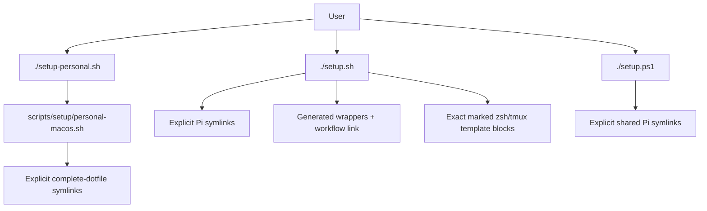
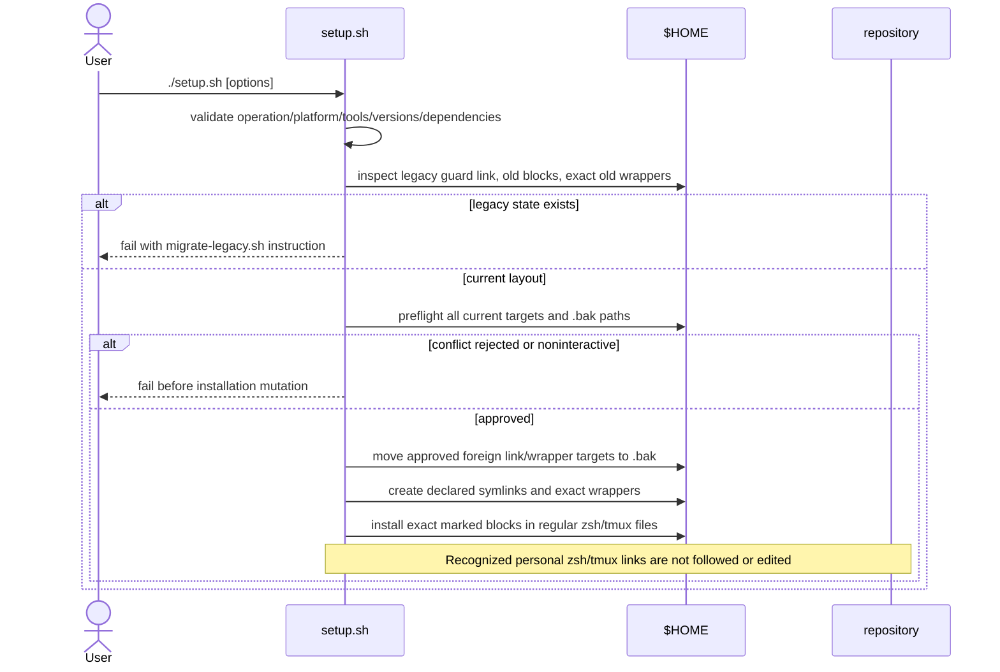
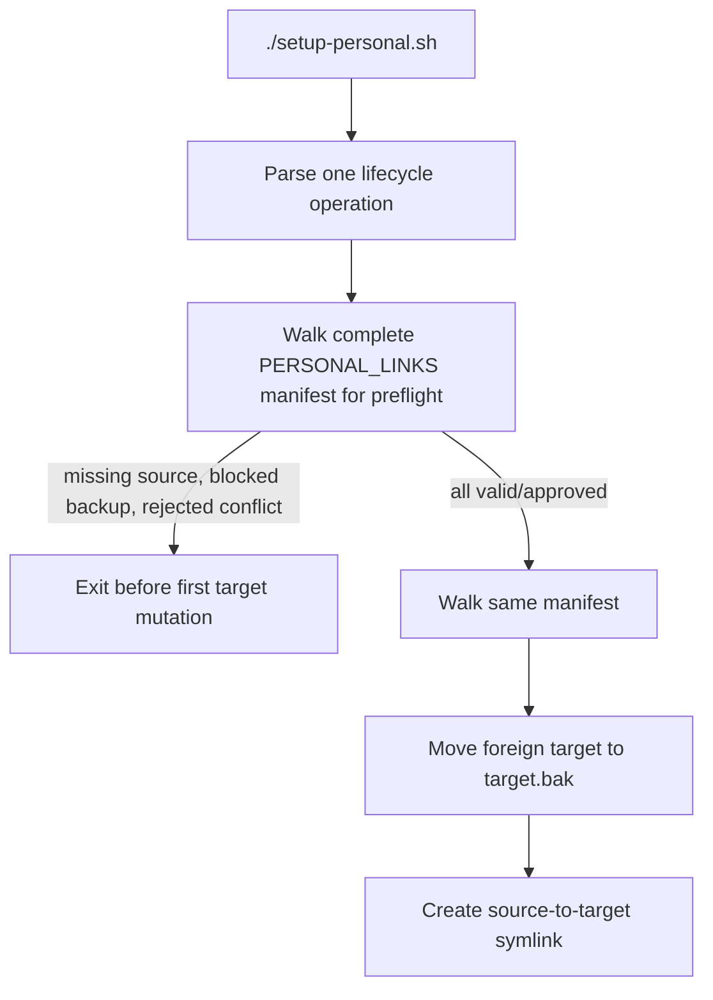
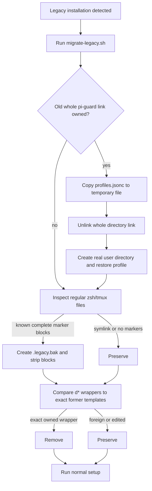
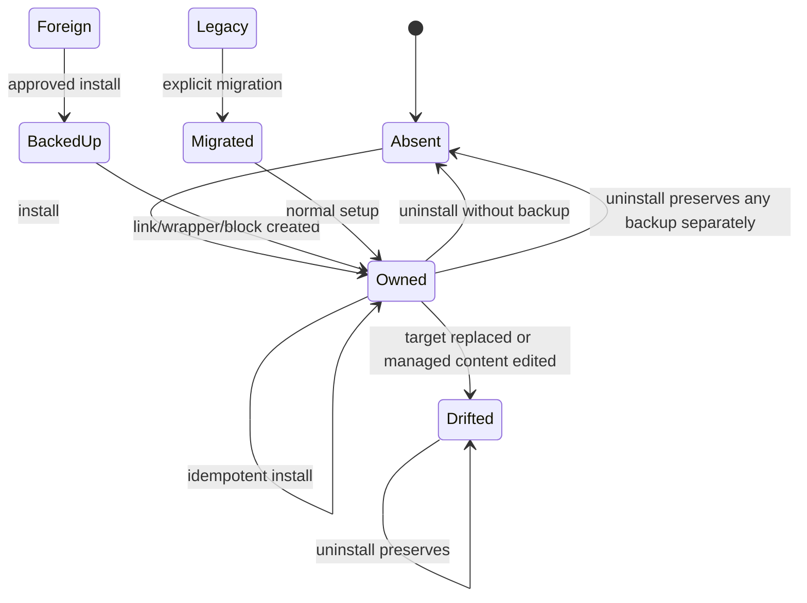

# Setup separation flow

## Overview

This change replaces the previous personal installer and team-specific entry points with two deliberately separate macOS policies:

- [`setup.sh`](setup.sh) is the safe, additive shared installer. It owns an explicit Pi/worktree surface and marked sections of regular shell/tmux files.
- [`setup-personal.sh`](setup-personal.sh) is an independent, opt-in personal installer. It backs up and replaces a stable list of complete personal dotfiles with repository symlinks.

[`setup.ps1`](setup.ps1) provides the shared Pi subset on native Windows. There is no mode selector. A user who wants both shared resources and personal dotfiles runs both macOS entry points explicitly.

Known old installer state is a hard break: normal shared setup refuses to mutate it and directs the user to the one-time [`scripts/setup/migrate-legacy.sh`](scripts/setup/migrate-legacy.sh).



## Changed-file map

### Public entry points

- [`setup.sh`](setup.sh) — changed from the old personal coordinator into the complete safe shared macOS installer. Keeping the implementation at its public entry point avoids a wrapper layer. Explicit arrays declare Pi files, packages, extensions, and command wrappers; separate templates declare shell/tmux content. Install validates tools/dependencies and all conflicts before mutation, refuses known legacy state, and recognizes personal-owned `.zshrc`/`.tmux.conf` links without editing through them.

- [`setup-personal.sh`](setup-personal.sh) — new explicit launcher for personal dotfile ownership. It never invokes shared setup.

  ```text
  resolve repository root
  exec scripts/setup/personal-macos.sh with unchanged arguments
  ```

- [`setup.ps1`](setup.ps1) — renamed from `setup-dev-pi.ps1`; removes the `-Mode shared` parameter, adds `-Verify`, verifies every declared Pi link, and refuses the old whole `pi-guard` link before nested targets are inspected. Windows intentionally excludes Unix wrappers and shell/tmux integration.

### Setup implementations

  ```text
  install: preflight all shared sources/targets, warn with optional install commands when nvim/lazygit are absent -> install links/wrappers/template blocks
  verify: check every declared source, link, executable wrapper, workflow, and exact block
  uninstall: remove exact owned artifacts and preserve backups for manual restoration
  ```

- [`scripts/setup/templates/shared.zsh`](scripts/setup/templates/shared.zsh) and [`scripts/setup/templates/shared.tmux`](scripts/setup/templates/shared.tmux) — readable canonical content for the two additive managed blocks; setup compares extracted blocks byte-for-byte with these templates.
- Deleted [`scripts/setup/shared-macos.sh`](scripts/setup/shared-macos.sh) — its implementation now lives directly in `setup.sh`.

- [`scripts/setup/personal-macos.sh`](scripts/setup/personal-macos.sh) — new stable personal manifest. It owns complete `.bash_profile`, `.gitconfig`, `.zshrc`, `.tmux.conf`, Cursor CLI, Pi guard profiles/prompts, Ghostty, Neovim, and OpenCode targets. It excludes Pi resources, command wrappers, and worktree files. The fixed target inventory remains available to uninstall even when source discovery would no longer find an entry.

  ```text
  install:
    validate every manifest source and every conflict/backup first
    for each entry, preserve a foreign target as .bak and create a symlink
  status/verify:
    classify or require every manifest link
  uninstall:
    remove only links with the expected textual target
    preserve adjacent backups for explicit manual restoration
  ```

- [`scripts/setup/migrate-legacy.sh`](scripts/setup/migrate-legacy.sh) — new, explicit one-time migration. It splits the old repository-owned whole `pi-guard` symlink into a real directory while copying `profiles.jsonc`; backs up regular zsh/tmux files before stripping known marker-delimited blocks; skips symlinked shell/tmux files to avoid repository writes; and removes `d*` wrappers only when their complete content matches one of the two former generated formats.

### Tests

- Deleted [`tests/setup-dev-pi.test.sh`](tests/setup-dev-pi.test.sh).
- Added [`tests/setup.test.sh`](tests/setup.test.sh), which runs public entry points against temporary homes and a fake toolchain/tmux executable. It covers shared lifecycle and drift, personal preflight/lifecycle, shared recognition of personal shell links, legacy refusal/migration, backup creation, exact wrapper cleanup, profile preservation, and repository non-mutation.

### Documentation

- [`README.adoc`](README.adoc) — documents the separate safe and personal entry points, ownership boundaries, lifecycle flags, explicit migration, shared dependency bootstrap, and mode-free Windows usage while preserving the repository's broader setup documentation.
- [`tmux_and_worktrees/README.adoc`](tmux_and_worktrees/README.adoc) — replaces mode-based installation with shared setup plus optional personal setup and their separate verification commands.
- [`home/.cursor/README.adoc`](home/.cursor/README.adoc) — points Cursor CLI ownership at `setup-personal.sh` instead of the deleted symlink helper.
- [`home/.pi/README.adoc`](home/.pi/README.adoc) — documents that guard profiles/prompts moved to personal setup and updates the shared macOS/Windows entry points.

### Deleted setup paths and commands

- Deleted [`setup_symlinks.sh`](setup_symlinks.sh) — dynamic broad personal linking is replaced by the explicit personal manifest.
- Deleted [`tmux_and_worktrees/setup.sh`](tmux_and_worktrees/setup.sh) — wrapper, workflow-link, and shell/tmux integration ownership moves into shared setup.
- Deleted [`tmux_and_worktrees/bin/dclose`](tmux_and_worktrees/bin/dclose), [`tmux_and_worktrees/bin/dkill`](tmux_and_worktrees/bin/dkill), [`tmux_and_worktrees/bin/dmerge`](tmux_and_worktrees/bin/dmerge), [`tmux_and_worktrees/bin/dnew`](tmux_and_worktrees/bin/dnew), [`tmux_and_worktrees/bin/dopen`](tmux_and_worktrees/bin/dopen), and [`tmux_and_worktrees/bin/dtree`](tmux_and_worktrees/bin/dtree). The explicit migration removes previously installed copies only when their exact generated contents prove ownership.
- [`tmux_and_worktrees/bin/dev`](tmux_and_worktrees/bin/dev) — removes help text claiming the deleted compatibility commands remain available; the `dev` subcommands remain the supported interface.

## End-to-end code flow

### Shared macOS installation



Dependency bootstrap is explicit. With `--bootstrap-pi-deps`, package `npm ci` calls and Playwright Chromium installation occur after conflict preflight and before configuration links are written. Without it, missing dependency state fails preflight.

### Personal macOS installation



Personal installation intentionally owns complete targets. Shared and personal setup do not invoke each other. If both are desired, personal shell/tmux links supply the integration already present in the checked-in files, while shared setup still owns Pi resources, wrappers, and the workflow link.

### Legacy migration



### Status, verification, and uninstall

- `--status` is observational and classifies each current declaration.
- `--verify` requires every declaration. Shared block verification compares complete text between exact markers, not marker presence alone.
- `--uninstall` checks ownership immediately before removal. Shared setup preserves drifted blocks; link/wrapper uninstall leaves adjacent backups for explicit manual restoration so an untracked `.bak` can never be promoted. Personal uninstall likewise preserves foreign/drifted targets and backups.
- `--dry-run` prints planned install/uninstall/migration actions without mutation; it cannot be combined with verify.

## Data and state flow

| Policy | Declaration | Target ownership unit | User data handling |
|---|---|---|---|
| Shared macOS | Pi/package/extension/command arrays and block constants | Explicit symlink, exact generated wrapper, exact marked block | Foreign resources require confirmation and `.bak`; regular dotfiles retain content outside markers |
| Personal macOS | `PERSONAL_LINKS` manifest | Complete file or application directory symlink | Existing target moves to `.bak` after full preflight/confirmation |
| Shared Windows | Parallel explicit PowerShell arrays | Explicit Pi symlink | Foreign target requires confirmation and `.bak` |
| Migration | Known old links, markers, and exact wrapper templates | Legacy artifacts only | Profile copied out of old link; regular edited files receive `.legacy.bak`; foreign wrappers preserved |

Important boundaries are the checked-out repository (link sources and executable wrapper destinations), `$HOME`, `/dev/tty`, npm registries/install scripts, Playwright's browser cache, and Windows symbolic-link support. Installed symlinks intentionally couple configuration to the repository's absolute location.

The central state transitions are:



## Test flow

[`tests/setup.test.sh`](tests/setup.test.sh) exercises:

1. a clean shared install with a user-owned guard profile and `~/bin/pi`;
2. complete shared verification, then negative package, wrapper, and exact block drift cases;
3. refusal to update a drifted block noninteractively and shared uninstall ownership behavior;
4. personal all-target preflight failure before the first manifest link;
5. personal install, verification, expected link targets, and uninstall;
6. personal zsh/tmux links followed by shared install/verify, with checksums proving repository dotfiles were not edited;
7. normal shared refusal of an old whole guard link without mutation;
8. migration rejection of malformed markers and pre-existing backup conflicts before mutation;
9. explicit legacy migration, including profile preservation, regular-file backup, marker removal, exact old-wrapper removal, and repository profile checksum stability;
10. foreign symlink-ancestor rejection, executable-wrapper validation, duplicate-block rejection, and preservation of untracked `.bak` files.

The test uses fake `uname`, `tmux`, Pi, Node/npm, editor, and Playwright commands first on `PATH`, so it cannot reload or modify a developer's real tmux server. Native PowerShell execution is not available in the current macOS environment, so the Windows path is reviewed and syntax-shaped consistently but not executed by this shell suite.
