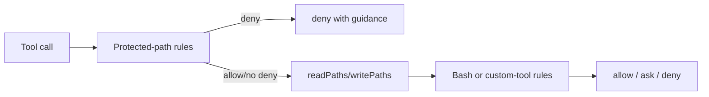

# pi-guard

Policy-driven guardrails, auto-pilot steering, permissions, and optional Bash
sandboxing for [Pi](https://pi.dev). It provides switchable profiles plus
customizable, layered composition of shipped profiles, rule sets, transforms,
and agent guidance.

## Install

> **Security:** pi-guard intercepts tool calls and can run a Bash sandbox. Review
> the source and choose a profile appropriate for the repositories it will use.

Pi installs packages directly; do **not** add this package to an application's
`dependencies`.

```bash
pi install npm:@trogers1/pi-guard
```

This adds the package to your global Pi settings. To install it only for the
current project, run `pi install -l npm:@trogers1/pi-guard` from that project. Pin a
release when repeatable upgrades matter:

```bash
pi install npm:@trogers1/pi-guard@0.1.0
```

Restart Pi after installing, then use `/profile` to inspect and select a
posture. The shipped `builtin:default` profile is selected when no custom
configuration chooses another profile. Your optional user configuration lives
at `~/.pi/agent/pi-guard/profiles.jsonc`; start with this minimal example:

```jsonc
{
  "defaultProfile": "my-project",
  "profiles": {
    "my-project": {
      "description": "Normal development with pi-guard's default posture.",
      "extends": ["builtin:default"],
    },
  },
}
```

For permission-aware delegation, install the companion package **after** this
one so its extension loads after pi-guard:

```bash
pi install npm:@trogers1/pi-guard-subagents
```

The companion remains useful by itself, but write scopes and inherited worker
profiles are enforced only when pi-guard is also loaded.

## Release (maintainers)

Both packages are independently published public npm packages. From a clean
checkout, run the full verification and inspect exactly what npm will ship:

```bash
cd home/.pi/agent/packages/pi-guard
npm ci
npm test
npm pack --dry-run

cd ../pi-guard-subagents
npm ci
npm test
npm pack --dry-run
```

Log in to npm as `trogers1`, bump the version in each package that changed
(which also updates its lockfile), then
publish pi-guard before the companion package:

```bash
cd home/.pi/agent/packages/pi-guard
npm version <new-version>
npm publish

cd ../pi-guard-subagents
npm version <new-version>
npm publish
```

Finally, install the published versions into a clean Pi profile with
`pi -e npm:@trogers1/pi-guard@<version>` (and the companion when applicable). Never run
`npm publish` until `npm pack --dry-run` contains only the runtime files listed
in each package manifest.

At runtime the extension loads the shipped profile registry, optionally composes the user JSONC config, selects a profile (subagent environment > directory binding > persisted session > configured default), then applies the policy to every tool call. Permissions are evaluated in this order:



For each rule collection, matching rules are ranked by literal segments, then literal characters, then later composed position. Therefore a broad wildcard is a fallback and inheritance ordering matters only for equivalent specificity.

Built-in profile, rule-set, and transform names are reserved under the `builtin:`,
`ruleset:`, and `transform:` namespaces respectively and cannot be overridden by user configuration.

## The specificity metric

Rules resolve by specificity, not by declaration order.

1. Collect every rule whose pattern matches the input.
2. Choose the rule with the most literal (non-wildcard) segments.
3. If two rules have the same number of literal segments, choose the one with
   the most literal characters.
4. If both metrics tie, the rule that appears later in the composed rule list
   wins.

`*`, `**`, and `?` contribute nothing to specificity, so `*` is a true
fallback: it only decides when no other rule matches. Order matters only as a
final tiebreak, which makes composition order-insensitive for rules of
different specificity.

## Profile catalog

| Profile                       | Purpose                                                                                                     |
| ----------------------------- | ----------------------------------------------------------------------------------------------------------- |
| `builtin:default`             | general-purpose main session: shell, git, package-manager, guard rule sets, and network-denied Bash sandbox |
| `builtin:default-with-net`    | default posture with unrestricted sandbox network access                                                    |
| `builtin:worker`              | default with `transform:deny-asks`; non-interactive subagents                                               |
| `builtin:read-only`           | inspection tools only; writes limited to tmp/handoff/progress                                               |
| `builtin:tests-only`          | default plus writes gated to test files                                                                     |
| `builtin:tests-hidden`        | default plus test files protected from read and write                                                       |
| `builtin:committer`           | default plus git-write rules (add/commit/rm/mv/reset/restore/checkout/rebase/cherry-pick/worktree)          |
| `builtin:reviewer`            | read-only plus test/build run rules                                                                         |
| `builtin:scribe-only`         | default plus writes gated to Markdown, docs/, and /tmp                                                      |
| `builtin:deps-mutator`        | default plus package-manager mutation allows                                                                |
| `builtin:no-shell`            | default path policy with all Bash commands denied                                                           |
| `builtin:implementation-only` | default plus test-file write denies                                                                         |
| `builtin:git-full`            | committer plus push/branch/tag/switch allows                                                                |

Dangerous or guardrail-loosening profiles are named to make their behavior
obvious (`deps-mutator`, `git-full`). Profiles may define optional `color`,
`emoji`, `directoryGlobs`, and `promptFile` metadata.

## Commands

- `/profile` opens a fuzzy-searchable profile picker. Type to search profile names and descriptions; use ↑/↓ and Return to select.
- `Alt+G` opens the same picker without leaving a draft prompt. `Ctrl+Shift+I` is its macOS-safe fallback; `Ctrl+G` remains Pi's external-editor shortcut, `Ctrl+Shift+G` navigates to the previous fullscreen transcript search result, and `Ctrl+Shift+P` cycles models.
- The remaining no-argument commands also have conflict-free `Ctrl+Shift` aliases: `A` `/profile-add`, `R` `/read-only`, `B` `/sandbox`, `N` `/sandbox-on`, `D` `/sandbox-off`, `X` `/sandbox-on-force`, `C` `/socrates`, and `Z` `/socrates-off`. `Ctrl+Shift+E` starts `/permissions explain ` in the editor so you can provide the required tool and input.
- `/profile <name>` switches to a profile.
- `/profile-add` creates a custom profile through one overview with ten sections: General, Prompt, Composition, Transforms, Bash, Read, Write, Protected, Sandbox, and Startup Directory globs. It validates the complete raw draft, reports typed errors on every affected section, and saves and activates the profile atomically. Sandbox capability expansion and automatic directory activation each require a second explicit confirmation.
- `/profile-edit` uses the same ten-section wizard for the active user-owned profile. It edits the exact raw declaration without materializing inherited values, including full identity rename, Prompt inheritance/disable/file modes, ordered composition and transforms, rules, Sandbox, and startup globs. Renames update exact `defaultProfile` and custom `extends` references while preserving JSONC comments and declaration order.
- In `/profile-add` and `/profile-edit`, Escape is local Back and retains section changes; Ctrl+C aborts the complete command without writing. A successful explicit save activates the saved profile immediately unless `PI_SUBAGENT_PROFILE` is authoritative.
- For an ASK request, choose `No (default)`, `Allow once`, or `Save rule(s) to profile…` when the request is concrete and authorable. Inline ASK remains rule-only and never exposes Prompt, Composition, Transforms, Sandbox, or Directory management. It may reuse General to create a child profile, defaulting its emoji from the shared custom-profile default and leaving color inherited. Esc returns to retained rules; Ctrl+C returns locally to the permission picker. Child creation and all selected rules are committed atomically before the request is checked again.
- `/read-only` switches to the `builtin:read-only` permissions profile.
- `/sandbox` reports the active sandbox state, backend, network posture,
  writable roots, subagent scope, Bash-tool ownership, and translation coverage.
- `/permissions explain <tool> <input>` explains which rule decided access for
  the given tool and input. For example:
  - `/permissions explain bash git status`
  - `/permissions explain read docs/readme.md`
  - `/permissions explain edit src/example.ts`

The output shows the active profile, the composition chain, every matching rule
ranked by specificity, the winning rule, which tiebreak fired, and any
protected-layer override that short-circuited the ordinary rule. For Bash, the
explainer also reflects shell read-validation, ordinary path-rule denies/asks
for operands, and the most-restrictive decision across compound commands. It
does not reflect the `PI_SUBAGENT_PERMISSIBLE_GLOBS` subagent narrowing layer.

Profile changes are persisted in the Pi session, so resumed sessions restore
their last selected profile.

## Sandbox execution

All shipped profiles enable the Bash sandbox. `builtin:default` denies network
access; choose `builtin:default-with-net` when Bash needs unrestricted network
access. `builtin:deps-mutator` and `builtin:git-full` also enable network access
for dependency and remote-Git workflows. The other shipped profiles deny it.

Sandboxing is configured per profile through the `sandbox` field. It adds an OS
boundary behind the normal permission gate: approved LLM Bash calls run through
the package-owned `bash` override, and its child process tree is contained.
User-authored `!`/`!!` commands use the same sandbox operations when this
package's `user_bash` handler runs. An earlier handler from another extension
can intercept user Bash first, so it cannot be an unconditional containment
claim.

macOS is the currently verified backend target and uses `sandbox-exec` through
`@anthropic-ai/sandbox-runtime`. A sandbox-enabled profile on an unavailable
platform/backend either blocks Bash (the default) or emits a warning and falls
back to local Bash when it explicitly sets `onUnavailable: "warn"`.

The sandbox applies only to Bash execution. Pi's in-process `read`, `grep`,
`find`, `ls`, `write`, and `edit` tools, custom tools, and other extensions
remain outside this process boundary and continue through the ordinary
permission gate.

See [the sandbox guide](docs/sandbox.md) for configuration, `network` posture,
filesystem derivation, protected-path waivers, coverage reporting, lifecycle,
and operational limits.

## Required read-only tools

This package **requires and will activate** pi's built-in `read`, `grep`,
`find`, and `ls` tools. Deny guidance throughout the policy steers agents to
these tools, so the gate assumes they are callable.

On session start and on every profile switch, the extension activates any
missing read tools. Activation is purely additive: tools enabled by you or by
other extensions are never removed. If a required tool is not even registered,
session start fails loudly — the installed pi version no longer provides a tool
this package depends on.

There is no opt-out from the activation itself. If a read tool should not be
usable, keep it active but deny its paths in your custom profile configuration.
Context-scoped rules restrict a denial to one tool without weakening the
others:

```jsonc
{
  "profiles": {
    "custom-default": {
      "extends": ["builtin:default"],
      "readPaths": [
        {
          "pattern": "**",
          "decision": "deny",
          "contexts": ["grep"],
          "guidance": "The grep tool is disabled here; search with Bash ripgrep instead.",
        },
      ],
    },
  },
}
```

## Rule sets

Shipped profiles are composed from reusable **rule sets** in
`modules/ruleSets.lib/`. Rule sets are partial policies: they add `tools`,
`readPaths`, `writePaths`, and `protectedPathRules`, but no scalars
(color/emoji/promptFile) and no transforms.

Shipped rule sets are addressable from JSONC through the reserved `ruleset:`
namespace, interchangeably with profiles in `extends`:

```jsonc
{
  "profiles": {
    "custom": {
      "extends": [
        "builtin:read-only",
        "ruleset:test-run",
        "ruleset:shell-guards",
      ],
    },
  },
}
```

Shipped rule sets include:

- `ruleset:shell` — base shell command rules.
- `ruleset:git` — base git inspection rules.
- `ruleset:git-commit` — committer posture: add/commit/rm/mv/reset/restore/
  checkout/rebase/cherry-pick/worktree plus `/dev/null` writes.
- `ruleset:git-refs` — push/branch/tag/switch.
- `ruleset:packageManagers` — base package-manager posture: unknown commands
  ask, queries allow, publish/credentials deny.
- `ruleset:deps-mutations-guard` — deny install/add/update/remove families
  (the `builtin:default` posture).
- `ruleset:deps-mutations-allow` — allow install/add/update/remove families
  (the `builtin:deps-mutator` posture).
- `ruleset:shell-guards` — destructive shell guards (`find -delete`, `git
fsck --lost-found`, etc.).
- `ruleset:path-guards` — default read paths, write paths, and protected-path
  rules.
- `ruleset:read-only-shell` — inspection-only Bash posture with explicit
  mutation denies.
- `ruleset:read-only-path` — read-only path posture with writes limited to
  tmp/handoff/progress and the standard protected-path layer.
- `ruleset:test-run` — npm/pnpm/yarn test and run, cargo build/test/check/
  clippy, go.
- `ruleset:docs-write` — writes gated to Markdown, docs/, and /tmp.
- `ruleset:test-write-protection` — test-file write denies.

When authoring a from-scratch profile, include `ruleset:shell-guards` so the
destructive shell guards stay in force. The two deps-mutations rule sets are
decision twins generated from one subcommand table.

### Custom rule sets

`rulesets` declares user-owned partial policy fragments. They may contain
only `tools`, `readPaths`, `writePaths`, and `protectedPathRules`; they cannot
select directories, configure a sandbox, carry profile metadata, extend another
policy, or apply transforms. Their map keys are unprefixed, nonempty names, and
profiles reference them through `customruleset:<name>`:

```jsonc
{
  "rulesets": {
    "infra-mutation-deny": {
      "tools": {
        "bash": [{ "pattern": "terraform apply*", "decision": "deny" }],
      },
    },
  },
  "profiles": {
    "safe-work": {
      "description": "Normal development with infrastructure mutation guards.",
      "extends": ["builtin:default", "customruleset:infra-mutation-deny"],
    },
  },
}
```

`ruleset:` remains exclusively for shipped rule sets. This prevents a local
configuration from shadowing a shipped rule set now or after a package upgrade.
Custom rule sets are partial and are not selectable profiles: the final profile
must still resolve to a complete policy.

## Multi-extends and transforms

A profile may declare `extends: string[]` and `transforms: string[]`.
`extends` folds left-to-right through `extendProfile`; the declaring profile's
own rules are applied last. This is concatenation, not intersection:
extending `builtin:read-only` then `builtin:default` re-opens Bash because the
default bash rules are appended after the read-only rules.

Transforms are applied once, after the full `extends` fold and in listed order,
but **before** the declaring profile's own rules. They normalize inherited
ordinary policy only: Bash, custom-tool, `readPaths`, and `writePaths` rules.
They never alter `protectedPathRules`; protected rules allow only `allow` or
`deny`, remain an independent first-stage safety layer, and continue to compose
through normal protected-rule specificity. Rules authored directly on the
profile are deliberate final overrides.

Shipped transforms:

- `transform:deny-asks` — every inherited ordinary `ask` becomes `deny`
  (non-interactive policy; what `builtin:worker` uses).
- `transform:allow-asks` — every inherited ordinary `ask` becomes `allow`
  (auto-approve; pair with containment).
- `transform:ask-all` — every inherited ordinary `allow` becomes `ask`
  (paranoid supervision; inherited denies unchanged).
- `transform:deny-all` — every inherited ordinary rule decision becomes
  `deny`.

```jsonc
{
  "profiles": {
    "worker-like": {
      "extends": ["builtin:default"],
      "transforms": ["transform:deny-asks"],
    },
  },
}
```

A profile's own `tools.bash`, `readPaths`, `writePaths`, and custom-tool rules
are composed after the transformed inherited ordinary policy. Its
`protectedPathRules` are appended to the unchanged inherited protected layer.
Local rules win equal-specificity ties; a local rule must be more specific to
outrank a more-specific inherited rule.

## Protected-path rules

Protected paths are configured with `protectedPathRules: Rule[]`, where each
rule has `pattern` and `decision` (`allow` or `deny` only; `ask` is rejected).
They apply across contexts: `read`, `grep`, `find`, `ls`, `edit`, `write`, and
Bash path references. A deny short-circuits every stage.

Protected rules concatenate under `extends` like every other rule array. To
weaken an inherited deny, author a more-specific allow:

```jsonc
{
  "protectedPathRules": [
    { "pattern": "**/.env*", "decision": "deny" },
    { "pattern": ".env.template", "decision": "allow" },
  ],
}
```

Exact-pattern conflicts across layers are load errors. To redefine a protected
pattern wholesale, write a from-scratch profile that owns its list.

## Directory-selected profiles

`directoryGlobs` is optional declaration metadata on a custom profile. A glob
identifies a _project root_: if it matches an ancestor of Pi's startup working
directory (`startupCwd`), the profile applies to that root and every descendant.
Matching is lexical and does not inspect the filesystem.

Use an absolute path, `~/path`, or `~` for the home directory. `*` matches
within one directory name, while `**` matches complete directory levels.

```jsonc
{
  "$schema": "https://raw.githubusercontent.com/trogers1/config/main/home/.pi/agent/packages/pi-guard/schemas/profiles.schema.json",
  "defaultProfile": "client-work",
  "profiles": {
    // Use this profile anywhere below ~/Code/client.
    "client-work": {
      "description": "Client work profile for the client repository.",
      "extends": ["builtin:default"],
      "directoryGlobs": ["~/Code/client"],
    },
    // Select this profile for a project such as /work/acme/frontend.
    "frontend-work": {
      "description": "Frontend workspace profile.",
      "extends": ["builtin:default"],
      "directoryGlobs": ["/work/*/frontend"],
    },
    // Select this profile from any project below the home directory.
    "personal-work": {
      "description": "Personal projects profile.",
      "extends": ["builtin:default"],
      "directoryGlobs": ["~"],
    },
  },
}
```

A profile can contain up to 128 unique directory globs. Globs are lexical (they
do not require the directories to exist); avoid trailing slashes, `.` or `..`
segments, and shell-only syntax such as character classes or brace expansion.

For overlapping matches, selection ranks the longest literal character prefix,
then the depth of the matched root, then the latest profile declaration. Thus a
literal project binding outranks a broad wildcard; later declarations decide
only an otherwise equal match.

At startup or resume, selection priority is: `PI_SUBAGENT_PROFILE`, then the
best `directoryGlobs` match for `startupCwd`, then the persisted session profile,
then `defaultProfile`. A directory selection therefore overrides a saved session
choice, and the subagent environment remains authoritative.

The package ships portable profiles only. Add custom profiles and directory
bindings in `~/.pi/agent/pi-guard/profiles.jsonc`. When this file does not
exist, pi-guard simply uses the shipped profiles and does not create a file. The
first successful `/profile-add` save creates it. Every custom profile requires a
nonempty `description`; the picker searches it as well as the profile name.

`extends` is optional. When supplied, it names a built-in profile by its
canonical name (for example `builtin:default`), a shipped rule set by its
`ruleset:` name, a custom rule set by its `customruleset:` name, or another
custom profile. Custom profile names are exact: `extends: ["default"]` resolves
only a custom profile literally named `default`; it does not fall back to
`builtin:default`. Without `extends`, the profile is fully custom and must
provide every required policy field. Omit `directoryGlobs` when no automatic
selection is wanted. A missing config file leaves the portable profiles active.
An existing invalid config file keeps the extension registered but blocks
permissions until the file is fixed. TypeScript consumers should import the
public policy types from `@trogers1/pi-guard/config`.

`/profile-add` and `/profile-edit` share an overview-first wizard for General,
Prompt, Composition, Transforms, four rule sections, Sandbox, and Startup
Directory globs. General edits the required name/description and optional emoji
and color. A rename atomically updates exact custom-profile `extends` references
and `defaultProfile` while retaining JSONC declaration order and comments. It
cannot rename a profile currently named by authoritative `PI_SUBAGENT_PROFILE`;
update the parent/launcher and restart that worker first.

Prompt omission inherits instructions, `null` disables inherited instructions,
and a string selects a file. User-authored paths must be absolute or begin with
`~/`. Existing targets must open as readable regular files, decode as strict
UTF-8, and be no larger than 256 KiB. A missing target may be created as an empty
file only during final commit when its parent exists. Runtime opens and checks
the same descriptor again on every agent start and fails closed if the target is
missing, non-regular, oversized, unreadable, or invalid UTF-8.

User-defined profile names must not start with `builtin:`, `ruleset:`,
`customruleset:`, or `transform:`. Defining a profile such as `builtin:default`
is invalid and blocks tool calls until the configuration is corrected. Use the
canonical built-in profile names, such as `builtin:worker` and
`builtin:read-only`.

## Subagent environment

The package consumes the environment variables exported by
`pi-guard-subagents`:

- `PI_SUBAGENT_PROFILE` selects the initial profile and overrides directory and
  persisted profile selection in a resumed worker session. Use canonical built-in
  or custom profile names such as `builtin:worker` or `client-work`; an unknown
  or unnamespaced old name like `worker` fails startup with the list of available
  profiles rather than silently granting the default policy.
- `PI_SUBAGENT_PERMISSIBLE_GLOBS` is a comma-separated list of paths or glob
  patterns relative to Pi's startup directory. When present, `edit`, `write`,
  Bash path references, and Bash output redirections are denied outside the
  declared scopes. Plain paths include their descendants; for example, `src`
  permits both `src` and `src/**`.

The permissible-scope layer only narrows the selected profile, so
protected-path and command restrictions still apply inside an allowed scope.
For sandboxed Bash, the same scopes also narrow kernel writable roots, covering
implicit child-process writes that do not appear as command operands. Pi's
dedicated read tools retain the profile's normal read access.

Profile status metadata is configured per profile:

```jsonc
"socrates": {
  "color": "cyan",
  "emoji": "🧠"
}
```

Supported colors: `black`, `red`, `green`, `yellow`, `orange`, `blue`, `magenta`,
`cyan`, `white`.

## Policy model

Profiles have one command-rule map, two ordered path-rule arrays, and an
optional protected-path-rule array. Resolution is specificity-first; order only
breaks ties.

- `tools.bash` patterns match normalized shell command segments.
- Other `tools.<name>` entries configure custom tools by matching glob patterns
  against named input properties. The built-in path tools cannot be configured
  here; they use the path arrays below.
- `readPaths` applies only to the dedicated `read`, `grep`, `find`, and `ls`
  tools, which this package activates automatically.
- `writePaths` applies to `edit`, `write`, and every Bash filesystem operand,
  including Bash readers and both input and output redirections. Bash is
  deliberately treated as write-capable even for apparently read-only commands.
  The one carve-out is `cd`: it mutates nothing and every later operand is gated
  individually against the tracked directory, so its target is gated against
  `readPaths` with the `ls` context instead.
- A path rule can set `contexts` to restrict itself to particular consumers.
  Valid read contexts are `read`, `grep`, `find`, and `ls`; valid write
  contexts are `edit`, `write`, and `bash`. A rule without `contexts` applies to
  every consumer of its array.
- Absolute path patterns such as `/tmp/**` match absolute paths; other patterns
  match paths relative to Pi's startup directory.
- Outside paths appear as `../...`, so `../**` gates external access.
- `*` is the default rule for a path array.
- Deny rules can include `guidance` and `alternatives`; these are returned in the
  blocked tool result, so Pi automatically gives them to the model without
  another prompt.

### Authoring matcher syntax

These syntaxes differ; do not copy Bash wildcard expectations into path rules.
Sandbox path arrays are sandbox-runtime paths, **not** either policy matcher.

| Field                | What it matches                                                          | Examples                                               | Wildcards                                                                                       |
| -------------------- | ------------------------------------------------------------------------ | ------------------------------------------------------ | ----------------------------------------------------------------------------------------------- |
| `tools.bash`         | normalized Bash command segments                                         | `git status`, `npm test *`                             | `*` matches any characters, including spaces and `/`; `?` matches one non-whitespace character. |
| `readPaths`          | `read`, `grep`, `find`, and `ls` paths, startup-relative unless absolute | `docs/**/*.md`                                         | `*` stays in one path segment; `**` matches directories.                                        |
| `writePaths`         | `edit`/`write` and analyzable Bash filesystem references/context         | `src/**/*.ts`                                          | `*` stays in one path segment; `**` matches directories.                                        |
| `protectedPathRules` | cross-cutting read/write safeguards                                      | `**/.env*`, `.env.template`                            | Uses the path-rule syntax above; an allow only exempts a broader protected deny.                |
| `directoryGlobs`     | ancestors/project roots of the immutable startup CWD                     | `~/Code/client`, `/work/*/frontend`, `/srv/**/service` | `*` stays in one segment; `**` is a complete directory segment.                                 |

For example:

```ts
{
  pattern: "npx vitest *",
  decision: "deny",
  guidance: "Use the repository's configured test script instead.",
  alternatives: ["npm test -- <requested test filters>"],
}
```

Because matching is specificity-first, steering comes only from the rule that
made the final deny decision. For compound bash commands, steering from each
denied segment is combined and deduplicated.

### Custom tools

Any tool name other than `bash` and the reserved path tools (`read`, `grep`,
`find`, `ls`, `edit`, and `write`) can have profile rules. A custom rule's
optional `match` object maps dot-separated input property paths to glob
patterns. Every property matcher must match; a rule without `match` is a
catch-all. Values are matched as strings, while non-string values use their JSON
representation. Matching rules resolve by specificity, with later rules breaking
ties; a configured custom tool with no matching rule defaults to `ask`. If a
tool has no configured rules at all, this package does not add a custom-tool
policy for it.

```jsonc
"tools": {
  "deploy": [
    { "decision": "ask" },
    {
      "decision": "deny",
      "match": {
        "environment": "production",
        "metadata.team": "platform-*"
      },
      "guidance": "Production deployments require explicit approval."
    },
    {
      "decision": "allow",
      "match": { "environment": "staging" }
    }
  ]
}
```

Built-in path tool names are rejected under `tools` so stale per-tool path
configuration cannot silently bypass `readPaths` or `writePaths`.

Bash syntax is parsed with `unbash`; that proves the shell structure and token
boundaries, not the executable semantics of every word. Limited command
adapters add command-specific meaning for a small shipped surface, mainly
ripgrep/readers, package managers, and Git, so only clearly understood operands
can be treated less conservatively: ripgrep patterns, Git revisions, and package
manager script names after `run`/`run-script` are proven non-paths, while
package manager directory options such as `--prefix` stay gated paths. All Bash
filesystem operands except `cd` targets, including input and output redirections,
use `writePaths` and the `bash` context. Parser errors and semantic uncertainty
ask interactively and block non-interactively. This intentionally avoids
guessing whether an arbitrary command, script, argument, or substitution will
mutate a path. Bash command rules remain a separate layer: they decide whether
the operation itself is allowed, while `writePaths` decides where an allowed
command may access the filesystem. Profile and rule-set bash rules resolve
specificity-first; order only breaks specificity ties. Profiles can deny shell
readers such as `grep` with guidance toward Pi's dedicated read tools when they
want broader read access than Bash access.

For example, this permits dedicated edits throughout `src`, while allowing Bash
only in `src/generated`:

```jsonc
"writePaths": [
  { "pattern": "src/**", "decision": "allow", "contexts": ["edit", "write"] },
  { "pattern": "src/generated/**", "decision": "allow", "contexts": ["bash"] }
]
```

The built-in test-focused profiles recognize conventional `test`, `tests`,
`__tests__`, and `integrationTests` directories, plus `*.test.*`, `*.spec.*`,
`*_test.*`, and `*.cy.*` file names. `builtin:tests-hidden` denies both
dedicated reads and mutations for these paths. Its test-path protected rules
are deliberately kernel-unenforced, however, so a sandboxed test runner can
load and execute the tests; the agent-facing permission gate remains in force.
`builtin:tests-only` retains the
default read policy and limits dedicated edits/writes and analyzable Bash
filesystem references to those test paths and `/tmp` scratch output; its Bash
denial guidance steers inspection to the dedicated `read`, `grep`, `find`, and
`ls` tools.

Bash output redirection targets use the same `writePaths` rules and `bash`
context as every other Bash path. Absolute and relative targets use the same
matching rules as `edit` and `write`; context-specific rules may still
distinguish dedicated mutations from Bash access.

The standard profiles configure `.env*` files and directories as protected and
`.env.template` as an explicit exception. Search safeguards are derived from the
active profile rather than hard-coded to `.env`: the built-in `grep` tool
combines all configured protected patterns into one exclusion glob, while Bash
`rg`/`ripgrep` receives one exclusion glob per pattern. Pi's built-in `grep`
accepts only one glob, so an include glob that could overlap a protected path
is denied with guidance to use Bash `rg` instead. For example,
`rg --glob '**/*.ts' 'PATTERN' .` retains the caller's TypeScript filter and
receives protected exclusions afterward, so those exclusions cannot be
re-included. Exceptions are not injected as positive globs — ripgrep treats any
positive glob as a whitelist for implicit searches, which would hide every
non-exception file — and they remain reachable because ripgrep searches
explicitly named paths regardless of globs. Raw `grep` and `git grep` are
denied because their recursive behavior cannot be safely rewritten across
supported platforms.

In non-interactive contexts where confirmation is unavailable, `ask` decisions
are blocked by default.

## Protected shell reads

Bash protects `.env*` basename and glob expressions as well as paths with a
slash. This includes forms such as `cat .env`, `head .env.local`, and
`sed -n '1,20p' **/.env*`; a direct `.env.template` path is the sole intended
exception.

Supported shell readers are allowed only when their adapters can identify their
filesystem operands. Static operands are evaluated against `writePaths` using
the Bash context. Ambiguous or dynamic filesystem operands require confirmation
when an interactive UI is available and are blocked non-interactively.
Separately, unsupported reader compositions—such as unbounded globs, pipelines,
substitutions, loops, `xargs`, `eval`, and shell-interpreter `-c` forms—may be
rejected directly when they cannot be analyzed safely. Use Pi's dedicated
`read`, `grep`, or `find` tools when broader read behavior is needed.

These checks are guardrails against accidental exposure, not a kernel-complete
filesystem boundary for arbitrary process execution. Keep secrets unavailable to
the agent process with filesystem permissions, environment isolation, or
sandboxing when strict isolation is required.
