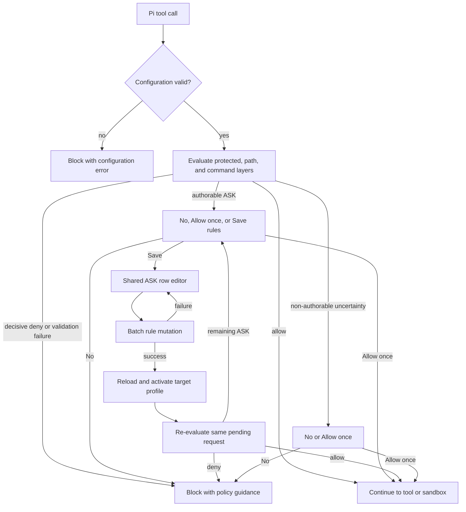
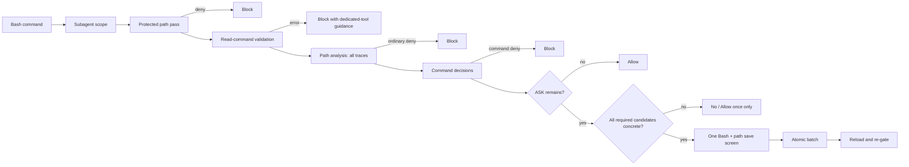
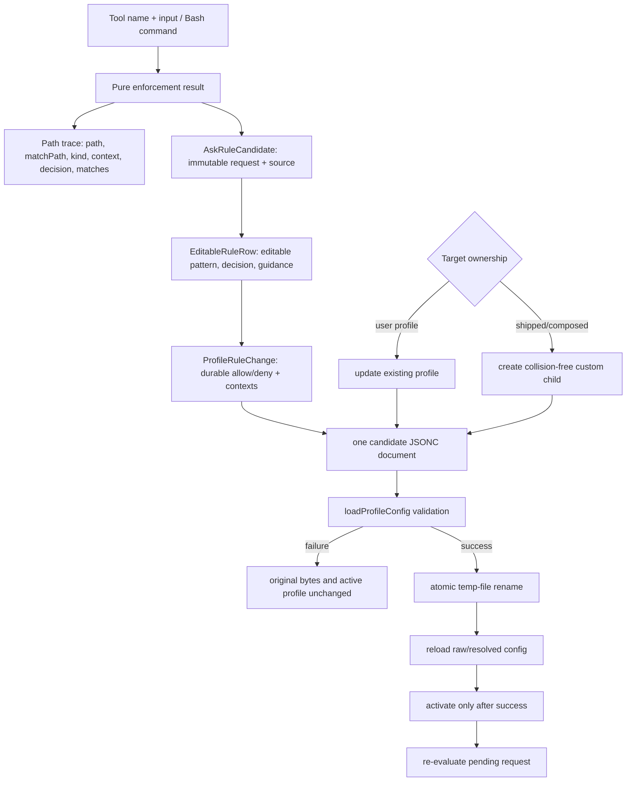
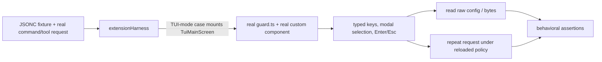

# Path-rule wizard refactor: required branch-flow map

## Overview

The completed refactor makes an interactive ASK a reviewable, typed rule change rather than a protected-path exception. Enforcement identifies the actual layer and operation context that caused the ASK, presents one shared editor, persists all selected changes in one validated atomic mutation, reloads the profile, and evaluates the same pending request again. CREATE uses the same row editor and now has an overview with four optional rule sections.

The plan baseline is commit `ac9699b`; the implementation below describes the current worktree after that baseline. Bash semantics remain deliberately conservative: ordinary Bash filesystem references are `writePaths`/`bash`, while `cd` is `readPaths`/`ls`. A protected rule is still a separate cross-cutting safety layer and is never invented to resolve an ordinary ASK.



## Changed-file map

### Runtime implementation

- `home/.pi/agent/packages/pi-guard/extensions/guard.ts` — wires the complete flow: direct read/write gating; Bash protected/path/command evaluation; ordered path traces; authorable candidate construction; contextual permission choices; shared ASK editor; child-profile targeting; batch persistence; reload and recursive re-check. `/profile-add` now gathers metadata/composition, shows an overview, edits optional Bash/read/write/protected sections with the shared editor, and creates/activates once.
- `home/.pi/agent/packages/pi-guard/modules/profileRuleEditor.ts` — production-owned `AskRuleCandidate`, `EditableRuleRow`, labels, destinations, effect copy, broader-pattern warning, context cycling, add/remove, reset, Back, target display, and the multi-row custom component used by both ASK and CREATE.
- `home/.pi/agent/packages/pi-guard/modules/profileConfig.ts` — adds `ProfileRuleChange`, `ProfileMutationTarget`, `assertUnambiguousProfileRuleChanges`, and `applyProfileRuleChanges`; supports update or create-child targets, four destinations, context-aware replacement, JSONC-preserving edits, whole-candidate validation, and one atomic rename. The former one-rule `appendProfileRule` API is removed in the breaking cutover. `createCustomProfile` accepts optional typed rule collections.
- `home/.pi/agent/packages/pi-guard/modules/profileUpdate.ts` — owns the three permission-choice strings: `No (default)`, `Allow once`, and `Save rule(s) to profile…`; obsolete update-target exports are gone.
- `home/.pi/agent/packages/pi-guard/modules/shell/pathPolicy.ts` — `BashPathReferenceTrace` now carries `kind`, `context`, and effective decision; analysis retains ordered `traces` plus non-authorable uncertainty while preserving first/blocking short-circuit behavior. `ls`/`cd` is read/`ls`; other conservative Bash filesystem references are write/`bash`.

Pseudocode for the runtime boundary:

```text
on tool_call:
  reject invalid configuration
  if bash:
    enforce subagent scope
    inject protected search exclusions
    gateBash(command, policy, rememberRule)
    if allowed, check sandbox ownership/availability
  else:
    inject grep safeguards if needed
    resolve readPaths or writePaths using tool context
    deny immediately, or open contextual ASK
```

### Directly related documentation, harness, and tests

- `home/.pi/agent/packages/pi-guard/README.md` — documents ordinary read/write path layers, contexts, shared CREATE/ASK behavior, save/re-check semantics, and removal of protected-path ASK terminology.
- `home/.pi/agent/packages/pi-guard/integrationTests/support/extensionHarness.ts` — drives production custom components and selections, translates legacy fixture choice names, removes target-picker support, and exposes modal/selection waiters without duplicating the editor.
- `home/.pi/agent/packages/pi-guard/integrationTests/profileConfigMutations.test.ts` — batch, atomicity, comment retention, context replacement/splitting, duplicate validation, and Bash/protected-context validation.
- `home/.pi/agent/packages/pi-guard/integrationTests/profileCreation.test.ts` — optional-section CREATE, all four layers, overview navigation, retention, discard, collision validation, and ASK child creation.
- `home/.pi/agent/packages/pi-guard/integrationTests/profileUpdateBehavior.test.ts` — public ASK behavior: allow/deny/skip, guidance, direct contexts, Bash path traces, additional rows, target editing, selective re-prompts, reset, and post-save enforcement.
- `home/.pi/agent/packages/pi-guard/modules/profileRuleEditor.test.ts` — focused production-editor behavior and semantic rendering checks.
- `home/.pi/agent/packages/pi-guard/integrationTests/decisionTable.test.ts`, `guard.test.ts`, `profiles.test.ts`, and `sandbox.test.ts` — updated integration expectations for the refactored enforcement and unchanged guardrail/profile/sandbox behavior.

### Worktree changes outside the wizard

These changed files are recorded for completeness but do not add wizard branches: `home/.pi/agent/packages/pi-guard/plans/path-rule-wizard-refactor.md` (Markdown formatting/comment alignment), `home/.pi/agent/packages/pi-guard-subagents/agents/reviewer.md` (reviewer model pin), and `home/.pi/agent/settings.json` (default provider/model). They should not be confused with the runtime path-rule flow.

## End-to-end code flow

### Direct read/write ASK

```mermaid
sequenceDiagram
  participant T as read/grep/find/ls/edit/write
  participant G as guard.ts
  participant E as profileRuleEditor
  participant P as profileConfig
  T->>G: tool_call(path)
  G->>G: resolve absolute path and context
  G->>G: protected layer, then readPaths/writePaths
  alt deny
    G-->>T: block + winning guidance
  else allow
    G-->>T: continue
  else ask
    G->>E: contextual permission choice
    alt No
      E-->>G: rejected; optional transient guidance
      G-->>T: block
    else Allow once
      E-->>G: approved without persistence
      G-->>T: continue
    else Save rule(s)
      G->>E: one prefilled row; target is update or suggested child
      E-->>G: allow/deny/skip, pattern, context, guidance
      G->>P: applyProfileRuleChanges(all non-skipped rows)
      P->>P: edit candidate JSONC, validate, atomic rename
      P-->>G: success or error
      alt error
        G-->>E: notify; retain draft and do not activate
      else success
        G->>G: reload profile and evaluate same path
        alt allow / deny / ask
          G-->>T: continue / block / reopen only unresolved ASK
        end
      end
    end
  end
```

A direct request is persisted to the collection that actually evaluated it: `read`/`grep`/`find`/`ls` to `readPaths`, or `edit`/`write` to `writePaths`, always scoped to the concrete tool context. It never becomes `protectedPathRules`.

### Bash ASK and precedence

`gateBash()` performs the following in order:

1. Reject opaque interpreters combined with shell control syntax.
2. Parse/classify shell commands and record parse errors.
3. Evaluate protected Bash paths first.
4. Validate supported shell readers.
5. Run path analysis in deny-first mode, then ASK-aware mode when appropriate.
6. Evaluate command rules and preserve command-deny precedence over a path ASK.
7. For an ASK, use the already captured ordered traces; do not re-analyze in the UI callback.
8. Offer save only when all unresolved candidates are concrete and authorable.
9. Save selected command/path rows as one batch and recursively re-run `gateBash()` with the freshly loaded policy. The Bash tool is not executed twice.



Traces are encountered in shell order and deduplicated only by `(kind, context, path)`. A normal operand/redirection is a `writePaths`/`bash` candidate; `cd` is a `readPaths`/`ls` candidate. Dynamic operands, opaque expressions, unknown relative CWD, parse uncertainty, and unsupported control-flow uncertainty remain non-authorable: they can be allowed once or denied, but the UI does not fabricate a durable glob. A protected deny, read-validation failure, ordinary path deny, or Bash command deny suppresses the save editor even if another part of the request asks.

### CREATE

```mermaid
stateDiagram-v2
  [*] --> Compose
  Compose --> Metadata
  Metadata --> Overview
  Overview --> BashEditor
  Overview --> ReadEditor
  Overview --> WriteEditor
  Overview --> ProtectedEditor
  Overview --> TransformEditor
  BashEditor --> Overview: Back / save section draft
  ReadEditor --> Overview: Back / save section draft
  WriteEditor --> Overview: Back / save section draft
  ProtectedEditor --> Overview: Back / save section draft
  TransformEditor --> Overview
  Overview --> DiscardConfirm: Esc
  DiscardConfirm --> Overview: No
  DiscardConfirm --> [*]: Yes; no write
  Overview --> AtomicCreate: Create and activate
  AtomicCreate --> Overview: validation/persistence failure
  AtomicCreate --> Activate: write + reload success
  Activate --> [*]
```



After composition and required metadata, the overview shows transform, sandbox, counts, and compact previews for `⚙️ Bash`, `📖 Read-path`, `✏️ Write-path`, and `🛡️ Protected safeguards`. All four are optional. Section Esc is Back and retains that section; Ctrl+Shift+R explicitly clears a CREATE section. CREATE uses safe deny defaults and writes metadata plus all selected collections in one validated mutation, then reloads and activates once.

## Data and state flow



The immutable `requestedValue`/request provenance remains visible even if the user edits the stored pattern. The editor shows layer, context/source, matched rule, exact destination, `ASK → ALLOW/DENY`, effect/non-effect, and a warning for a broader/custom pattern. Request rows start as allow; Tab cycles allow/deny/skip. Additional ASK rows start as deny, are labelled as additional, and can change kind/context. Skipped rows are omitted from persistence and remain ASK candidates on recheck. A child profile and its rules are never written separately: a collision, invalid context, duplicate identity, or validation failure leaves no empty child behind.

Context-aware replacement removes only the relevant identity. A scoped update can split an existing multi-context rule, preserves sibling contexts, preserves an unscoped fallback, and never touches the other ordinary collection or protected layer. Bash/protected identities remain unscoped and collection-local.

## Test flow and remaining gaps



The current suite verifies: mixed atomic Bash/read/write batches; no-write preflight failures; comment preservation; scoped replacement/splitting and distinct contexts; all four CREATE sections and optional empty CREATE; overview Back/clear/discard; child target collision recovery; direct read/write context boundaries; Bash `cd` and redirection semantics; ordered multi-candidate ASK; deduplication; additional rules; broader patterns; allow/deny/skip; persistent versus transient guidance; reset; reload/recheck; profile switching; and sandbox/profile regressions. Focused editor tests check production rendering and controls, while `profileUpdateBehavior.test.ts` drives the public extension surface rather than private state.

The durable-save permission-picker journey also mounts the production components in pi-tui's real regular-screen `TuiMainScreen`, routes input through terminal/TUI focus dispatch, persists the rule, reloads policy, and proves an exact retry is prompt-free. Lower-level matrix tests complement these public journeys for parser uncertainty and exhaustive policy combinations. The implementation deliberately does not claim arbitrary Bash semantic read/write classification; that remains a separate policy/migration project. The unrelated reviewer/settings metadata changes do not participate in this flow.
