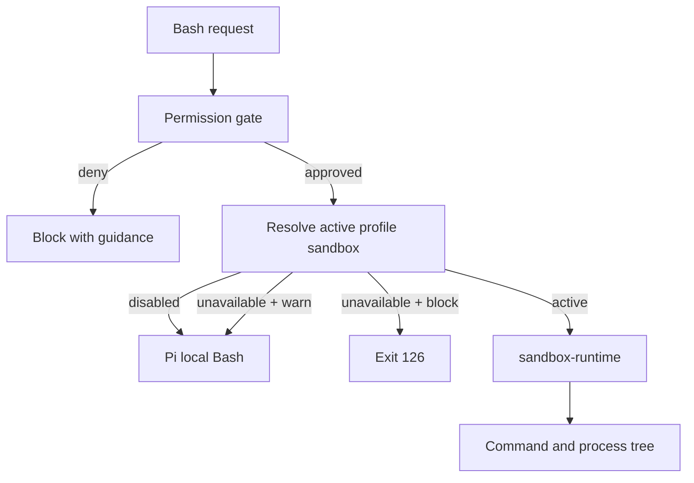
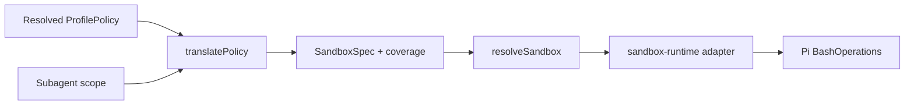

# Bash sandboxing

`pi-permissions` can apply kernel-enforced containment to Bash processes. It is
a profile capability: the normal permission gate still determines
whether a request is allowed, asked, or denied; the sandbox constrains the
approved command and every descendant process.



## Scope

The sandbox contains:

- LLM `bash` tool calls after they pass the permission gate.
- User-authored `!` and `!!` Bash through Pi's `user_bash` integration, subject
  to Pi handler ordering.
- Child processes, command substitutions, package scripts, compilers, and
  other effects not visible to the shell parser.

It does **not** contain Pi's in-process `read`, `write`, `edit`, `grep`,
`find`, or `ls` tools, arbitrary custom tools, or execution initiated by other
extensions. Those remain governed by the normal permission gate. For a whole
agent boundary, run Pi itself in a container or VM.

## Profile configuration

All shipped profiles configure sandboxing. `builtin:default` and the restricted
workflow profiles deny network access; `builtin:default-with-net`,
`builtin:deps-mutator`, and `builtin:git-full` allow it. Custom profiles inherit
the sandbox posture of their resolved parent unless they set `sandbox` to a new
object or `false`.

Set `sandbox` on a custom profile to choose its posture:

```jsonc
{
  "profiles": {
    "sandboxed": {
      "extends": ["builtin:default"],
      "sandbox": {
        "network": "deny",
        "extraWritePaths": ["build-cache"],
        "extraDenyReadPaths": ["~/Library/Keychains"],
        "extraDenyWritePaths": ["secrets/output"],
        "enableWeakerNetworkIsolation": true,
        "allowLocalBinding": true,
        "onUnavailable": "block",
      },
    },
  },
}
```

`network` is required:

- `"deny"` blocks network access.
- `"allow"` permits unrestricted network access.

`onUnavailable` defaults to `"block"`:

- `"block"` returns Bash exit code 126 when the backend cannot establish the
  requested boundary.
- `"warn"` visibly warns and falls back to ordinary local Bash.

The optional path arrays are additive:

| Field                          | Effect                                                                        |
| ------------------------------ | ----------------------------------------------------------------------------- |
| `extraWritePaths`              | Additional writable roots when policy-derived writes are too narrow.          |
| `extraDenyReadPaths`           | Additional kernel-enforced read denials.                                      |
| `extraDenyWritePaths`          | Additional kernel-enforced write denials.                                     |
| `enableWeakerNetworkIsolation` | On macOS, permits sandbox-runtime's trustd IPC relaxation.                    |
| `allowLocalBinding`            | Permits local Unix-domain and loopback listeners without external networking. |

`enableWeakerNetworkIsolation` defaults to `false`. It is a sandbox-runtime
option whose current macOS effect is permitting the `com.apple.trustd.agent`
service. Enable it when a sandboxed Go-based TLS client—such as `glab`, a Go
HTTP client, or another Go CLI—must validate a server certificate through
macOS's trust service. This weakens network isolation by admitting that system
IPC service and can create a data-exfiltration vector, but it does not disable
certificate verification. Do not enable it merely to bypass an untrusted or
invalid certificate.

`allowLocalBinding` defaults to `false` when omitted; `builtin:default` enables
it because a normal local build/test toolchain commonly needs a Unix-domain or
loopback listener, such as `tsx`'s IPC socket. It does not allow external
network access, but permits communication with other local processes that can
reach the listener.

See the [sandbox runtime security
limitations](https://github.com/anthropic-experimental/sandbox-runtime#security-limitations)
for the upstream implementation details and risk assessment.

Configured filesystem paths reject NUL and line-break characters. `~` expands
to the current user's home directory; relative paths resolve from Pi's startup
working directory.

### Composition

`sandbox` is scalar profile metadata:

- An omitted value inherits the resolved parent value.
- `sandbox: false` explicitly disables inherited sandboxing.
- An object replaces an inherited sandbox object; its nested fields do not
  deep-merge.
- Profile transforms do not alter sandbox metadata.

## Policy translation

The active, fully composed profile is the source of truth. It compiles to a
backend-neutral `SandboxSpec` before Bash is executed.

### Filesystem

- Bash writes start denied. Only effective `writePaths` rules applicable to the
  `bash` context, plus `extraWritePaths`, open writable roots.
- `ask` write rules remain kernel-denied. Approving an ask prompt does not
  dynamically widen the sandbox.
- Effective protected denies become both read and write denials.
- A protected allow can restore a protected read exception, but never grants
  write access on its own.
- If the backend cannot preserve a required restriction or protected-path
  precedence, sandbox preparation fails closed.
- If it cannot represent an allow, the sandbox stays active but remains
  tighter than the gate.

`readPaths` deliberately does not become a Bash read allowlist. Dedicated
read-tool policy and arbitrary Bash runtime reads have different requirements;
Bash reads are constrained by protected-path denials instead.

### Protected-path waivers

Some workflows need a protected path in an implicitly accessed process, such
as Git metadata. A profile may leave an exact protected deny gate-only:

```jsonc
{
  "sandbox": {
    "network": "allow",
    "kernelUnenforcedProtectedPaths": ["**/.git", "**/.git/**"],
  },
}
```

Every waiver must exactly match an effective protected deny pattern. It does
not relax the permission gate, and `/sandbox` reports it as a kernel coverage
waiver. Keep waivers minimal.

### Subagent scopes

When `PI_SUBAGENT_PERMISSIBLE_GLOBS` is present, its normalized roots narrow
both the ordinary path gate and sandbox writable roots. A scope can only
reduce profile/configured write access; it cannot add write access, remove a
protected denial, or affect networking.

## Resolution and lifecycle

Sandbox resolution produces one of three states:

| State         | Bash behavior                                                                                                                                         |
| ------------- | ----------------------------------------------------------------------------------------------------------------------------------------------------- |
| `none`        | The selected profile has no sandbox or explicitly uses `false`; local Bash runs normally.                                                             |
| `unavailable` | The backend, configuration, or translation cannot establish the boundary; behavior follows `onUnavailable`, except configuration errors always block. |
| `active`      | Bash uses prepared sandbox operations.                                                                                                                |

Resolution is performed at session start, profile activation, UI/prompt
updates, and again immediately before execution. Profile activation is
serialized; it clears prepared state before resolving the new profile. The
runtime is process-global, so preparation, execution, and disposal are also
serialized.

The extension registers one switchable `bash` override. While sandboxing is
active, it verifies that this override still owns the effective Bash tool; a
replacement by another extension blocks execution rather than running an
unknown implementation outside the requested boundary.

## Status and inspection

Use `/sandbox` to inspect the current posture. Use `/sandbox-off` to disable
Bash sandboxing for the current session. `/sandbox-on` clears that override and
returns to the active profile's configured posture. Use `/sandbox-on-force` to
explicitly force a conservative no-network sandbox for a profile with
`sandbox: false`; filesystem restrictions still derive from that profile's
resolved policy. The override is persisted in session history. The status
indicator uses `🔐` when sandboxing is on and `❌` when it is off. Active output
includes the backend, network mode, effective writable roots, subagent scope,
Bash-tool ownership, and coverage summary. The report distinguishes:

| Coverage category       | Meaning                                                                                  |
| ----------------------- | ---------------------------------------------------------------------------------------- |
| `uncoveredRestrictions` | Required restriction the backend/compiler cannot prove; sandbox activation blocks.       |
| `waivedRestrictions`    | Explicit profile-authorized gate-only protected restriction.                             |
| `untranslatedAllows`    | Gate may allow access that the kernel intentionally keeps denied.                        |
| `noKernelMeaning`       | Policy concept that has no Bash filesystem boundary, such as dedicated-tool `readPaths`. |

The agent prompt also describes an active sandbox's backend and network posture
or explains why Bash is blocked/falling back.

## Backend support

The implementation uses `@anthropic-ai/sandbox-runtime` behind
[`modules/sandbox.lib`](../modules/sandbox.lib/). macOS is the currently
verified target and uses `sandbox-exec`. If the runtime or prerequisite is not
available, the selected profile's unavailable posture applies.

The backend is intentionally isolated from policy translation:



## Operational limitations

- Bash tool ownership and `user_bash` interception depend on Pi extension load
  order. An earlier `user_bash` handler may handle user Bash before this
  package sees it.
- Sandboxing does not grant permission: command, protected-path, and prompt
  decisions still come from the normal gate.
- A sandboxed profile can still modify any workspace locations that its
  resolved Bash `writePaths` allow.
